B2B工业设备宣传与电商平台 - 版本号：V1.0

软件名称：B2B工业设备宣传与电商平台

版本号：V1.0

（注：最终文档页码位于每页右上角）

---

## 1. 软件概述

### 1.1 软件背景与用途

B2B工业设备宣传与电商平台是一款面向工业设备行业的B2B综合服务型后端系统，旨在为工业视觉检测、自动化设备、工业相机、光源镜头、测量仪器、工业机器人等领域的供应商与采购方搭建高效的线上对接平台。该平台覆盖设备产品展示与销售、设备租赁（融资租赁与经营租赁）、供应商入驻与认证审核、行业内容发现（视频测评、技术教程、行业资讯等）、用户互动（评论、点赞、收藏、分享）以及后台运营管理等核心业务场景。

本软件通过前后端分离架构，后端提供标准化的RESTful API接口，为前端或第三方系统提供统一的数据服务与业务逻辑处理能力。

### 1.2 开发目标与特点

基于对源代码的分析，本软件具有以下开发目标与技术特点：

1. **模块化设计**：系统采用模块化架构，按业务领域划分为系统认证模块（system）、商品管理模块（product）、供应商管理模块（supplier）、租赁模块（leasing）、内容管理模块（content）、订单与购物车模块（order）、用户交互模块（interaction）以及管理后台模块（admin），各模块职责明确、低耦合高内聚。

2. **安全认证体系**：基于Spring Security + JWT实现无状态令牌认证，结合图形验证码和邮箱验证码实现多因素身份验证，支持用户角色（USER/SUPPLIER/ADMIN）的差异化访问控制。

3. **高性能缓存策略**：采用Redis实现购物车数据的持久化存储（Hash结构），以及验证码的短时效缓存，有效降低数据库压力并提升系统响应速度。

4. **多角色业务支持**：支持普通采购用户、供应商和管理员三种角色，覆盖从商品浏览与下单、供应商入驻与审核、设备租赁、到运营数据统计的完整业务链路。

5. **统一响应封装**：所有接口响应通过统一的`Result<T>`泛型包装类返回，包含状态码（code）、消息（message）和数据（data）三个标准字段，并配套全局异常处理机制。

### 1.3 运行环境与技术架构

本软件的运行环境与技术栈如下：

| 类别 | 技术/版本 |
|------|-----------|
| 开发语言 | Java 17 |
| 核心框架 | Spring Boot 3.2.2 |
| 安全框架 | Spring Security（含JWT认证过滤器） |
| 持久层框架 | MyBatis-Plus 3.5.5 |
| 数据库 | MySQL（InnoDB引擎，utf8mb4字符集） |
| 缓存中间件 | Redis（Lettuce客户端） |
| 邮件服务 | Spring Boot Starter Mail（SMTP协议） |
| 接口文档 | Knife4j 4.5.0（基于OpenAPI 3.0） |
| 工具库 | Hutool 5.8.25 |
| JWT库 | JJWT 0.11.5（HS256算法） |
| 构建工具 | Apache Maven |
| 连接池 | HikariCP |
| 项目结构 | 单体Spring Boot应用，内部按模块分包 |

系统以Spring Boot可执行JAR方式独立部署运行，监听端口为8999，通过跨域过滤器支持前后端分离调用。

---

## 2. 系统架构图

本节展示B2B工业设备宣传与电商平台的整体系统架构。架构图从客户端请求入口出发，经过安全过滤层、控制器层、服务层，直至数据持久层和外部依赖，完整呈现各层级和模块之间的依赖与数据流转关系。

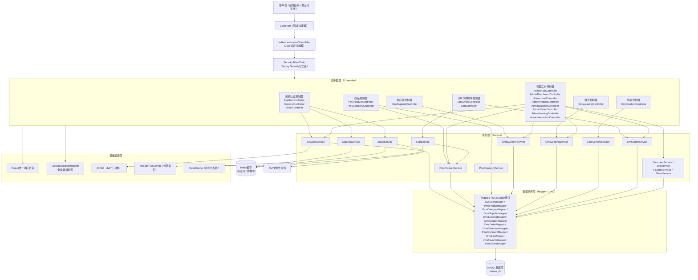

**图2-1 系统架构图**

如图2-1所示，系统整体遵循经典的分层架构模式。客户端请求首先经过跨域过滤器（CorsFilter），再由JWT认证过滤器解析并验证令牌，最终由Spring Security安全链放行后路由至对应的控制器。控制器层按业务领域划分为七大模块组，分别处理系统认证、商品管理、供应商管理、租赁管理、内容管理、订单与购物车、以及管理后台的请求。所有控制器通过统一的`Result<T>`包装类返回响应，异常情况由全局异常处理器统一捕获处理。

服务层承担核心业务逻辑，与数据访问层（MyBatis-Plus Mapper）交互完成数据持久化操作。同时，验证码服务、邮件服务和购物车服务通过Redis缓存实现高性能的数据读写。邮件服务额外依赖外部SMTP服务器完成验证码邮件投递。

---

## 3. 功能模块设计

### 3.1 功能结构概览

系统功能按业务领域划分为八大功能模块，下图展示了各模块的层级关系与子功能分解。

```mermaid
graph TD
    ROOT["B2B工业设备宣传与电商平台"]

    ROOT --> MOD1["系统认证模块"]
    ROOT --> MOD2["商品管理模块"]
    ROOT --> MOD3["供应商管理模块"]
    ROOT --> MOD4["租赁管理模块"]
    ROOT --> MOD5["内容管理模块"]
    ROOT --> MOD6["订单与购物车模块"]
    ROOT --> MOD7["用户交互模块"]
    ROOT --> MOD8["管理后台模块"]

    MOD1 --> F1_1["用户注册"]
    MOD1 --> F1_2["用户登录"]
    MOD1 --> F1_3["密码重置"]
    MOD1 --> F1_4["图形验证码生成与校验"]
    MOD1 --> F1_5["邮箱验证码发送与校验"]
    MOD1 --> F1_6["用户信息获取"]

    MOD2 --> F2_1["商品列表查询（分页/筛选/排序）"]
    MOD2 --> F2_2["商品详情查看（含浏览量统计）"]
    MOD2 --> F2_3["商品分类管理（CRUD）"]

    MOD3 --> F3_1["供应商列表查询"]
    MOD3 --> F3_2["供应商详情查看"]
    MOD3 --> F3_3["供应商创建/更新/删除"]

    MOD4 --> F4_1["租赁设备列表（筛选类型/名称）"]
    MOD4 --> F4_2["租赁设备详情查看"]

    MOD5 --> F5_1["内容列表（按类型/分类筛选）"]
    MOD5 --> F5_2["内容详情（含浏览量統计）"]
    MOD5 --> F5_3["内容CRUD管理"]

    MOD6 --> F6_1["购物车管理（增删改查/清空）"]
    MOD6 --> F6_2["购物车下单"]
    MOD6 --> F6_3["直接下单（免购物车）"]
    MOD6 --> F6_4["订单列表查询"]
    MOD6 --> F6_5["订单详情查看"]
    MOD6 --> F6_6["模拟支付"]
    MOD6 --> F6_7["订单取消"]

    MOD7 --> F7_1["商品评论"]
    MOD7 --> F7_2["点赞"]
    MOD7 --> F7_3["收藏"]
    MOD7 --> F7_4["分享"]

    MOD8 --> F8_1["管理员登录与认证"]
    MOD8 --> F8_2["仪表盘统计"]
    MOD8 --> F8_3["用户管理（CRUD/封禁/重置密码）"]
    MOD8 --> F8_4["商品管理（CRUD/上下架/批量操作）"]
    MOD8 --> F8_5["供应商管理（CRUD/审核/认证状态）"]
    MOD8 --> F8_6["订单管理（查询/状态更新/删除）"]
    MOD8 --> F8_7["租赁设备管理（CRUD/上下架）"]
    MOD8 --> F8_8["交互数据管理（评论/点赞/收藏/分享）"]
```

**图3-1 功能模块结构图**

### 3.2 各模块详细描述

#### 3.2.1 系统认证模块（system）

系统认证模块负责用户身份的注册、登录、密码重置以及认证辅助功能。该模块由`SysUserController`、`CaptchaController`和`EmailController`三个控制器协同工作。

- **用户注册**：接收用户名、密码、确认密码、邮箱、昵称、角色（USER/SUPPLIER）等信息，经图形验证码校验、邮箱验证码校验和密码一致性检查后，对密码进行BCrypt加密，创建用户记录并持久化至数据库。用户名需全局唯一。
- **用户登录**：接收用户名、密码、图形验证码和登录角色，校验验证码有效性后，通过BCrypt密码比对和账号状态检查完成身份验证，并根据角色校验逻辑（管理员角色可跨角色登录，非管理员角色需严格匹配）生成JWT令牌返回客户端。
- **密码重置**：通过图形验证码、邮箱验证码双重验证后，根据用户名和邮箱匹配用户记录，使用BCrypt对新密码加密后更新数据库。
- **图形验证码**：基于Hutool的LineCaptcha生成200×80像素、4位字符的图形验证码，以UUID为键存入Redis（5分钟有效期），返回UUID和Base64编码的图片数据。验证时一次性消费，忽略大小写。
- **邮箱验证码**：生成6位随机数字验证码，以`email:code:{type}:{email}`为键存入Redis（5分钟有效期），通过SMTP协议发送HTML格式的验证码邮件。验证后立即删除Redis中的记录。

#### 3.2.2 商品管理模块（product）

商品管理模块提供面向用户端的商品浏览与搜索功能。`PmsProductController`支持分页查询商品列表，可按商品名称模糊搜索、按分类ID筛选，并支持按销量（sales）、价格升序（price-low）、价格降序（price-high）、最新上架（newest）和综合排序（默认，按销量+浏览量降序）五种排序策略。商品详情接口在返回数据的同时自动递增浏览量计数。`PmsCategoryController`提供商品分类的完整CRUD功能。

#### 3.2.3 供应商管理模块（supplier）

供应商模块通过`OmsSupplierController`提供供应商的分页列表查询、详情查看以及创建、更新、删除等操作。供应商实体存储企业名称、Logo、简介、联系方式（JSON格式）、认证状态和关联用户ID等信息。

#### 3.2.4 租赁管理模块（leasing）

租赁模块面向用户端提供设备租赁信息的浏览功能。`OmsLeasingController`支持按租赁类型（financing融资租赁/operating经营租赁）、设备名称进行筛选查询，默认仅展示上架状态的设备，按已租次数降序排列。融资租赁设备包含月租金、设备总价和租期信息；经营租赁设备包含日租金、周租金和月租金信息。

#### 3.2.5 内容管理模块（content）

内容管理模块通过`CmsContentController`提供行业内容（文章、视频、Vlog等）的发布与浏览功能。支持按内容类型（video/article/vlog）和分类（review测评/tutorial教程/vlog/news资讯）进行筛选。内容详情接口自动递增浏览量。模块支持完整的CRUD操作。

#### 3.2.6 订单与购物车模块（order）

该模块由购物车和订单两个子模块组成：

- **购物车**（CartService）：基于Redis Hash结构实现，以`cart:user:{userId}`为键，商品ID为Hash Field，`CartItemDTO`序列化对象为Hash Value。支持添加商品（已存在则累加数量）、修改数量、单项删除、清空购物车等操作，购物车数据设置30天自动过期。
- **订单**（OmsOrderService）：支持两种下单方式——购物车下单（从Redis购物车中筛选选中商品）和直接下单（无需购物车）。下单流程自动计算订单总金额、通过Hutool的Snowflake算法生成唯一订单号、在事务中创建订单主表和订单明细表记录，购物车下单完成后自动清除已下单的购物车项。订单支持状态流转：待付款(0) → 待发货(1) → 已发货(2) → 已完成(3)，或待付款(0) → 已取消(4)。

#### 3.2.7 用户交互模块（interaction）

用户交互模块包含四个子服务：评论服务（CommentService）、点赞服务（LikeService）、收藏服务（FavoriteService）和分享服务（ShareService）。这些服务当前通过管理后台进行数据的查询与维护管理，提供评论内容审核（显示/隐藏）、点赞记录管理、收藏记录管理和分享记录查询等功能。点赞和收藏支持多目标类型（商品、评论、内容、供应商），分享支持多平台记录（微信、微博、复制链接）。

#### 3.2.8 管理后台模块（admin）

管理后台模块提供系统运营所需的全面管理功能，核心控制器包括：

- **AdminAuthController**：管理员专属登录接口，强制校验ADMIN角色，通过`@PreAuthorize("hasRole('ADMIN')")`注解保护管理员信息查询接口。
- **AdminDashboardController**：提供仪表盘统计数据（用户总数、供应商总数、待审核供应商数、商品总数、订单总数）及最新注册用户和最新上架商品列表。
- **AdminUserController**：用户CRUD、状态管理（封禁/解封）、密码重置（重置为默认密码）、批量删除等功能，内置管理员角色保护逻辑（不允许删除或修改管理员账号角色）。
- **AdminProductController**：商品CRUD、上架/下架控制、批量上下架与批量删除操作。
- **AdminSupplierController**：供应商CRUD、审核（通过时自动升级关联用户角色为SUPPLIER）、认证状态更新。
- **AdminOrderController**：订单列表查询（按订单号/状态筛选）、状态更新、删除（级联删除订单明细）、批量删除、订单统计。
- **AdminLeasingController**：租赁设备CRUD与上下架状态管理。
- **AdminInteractionController**：评论、点赞、收藏、分享四类交互数据的列表查询、状态更新、单条删除和批量删除，以及交互数据统计。

---

## 4. 核心算法与流程

### 4.1 用户认证与登录流程

用户登录是系统的核心安全流程，涉及图形验证码校验、密码验证、角色匹配和JWT令牌生成等关键步骤。以下流程图展示了从客户端发起登录请求到返回JWT令牌的完整处理过程。

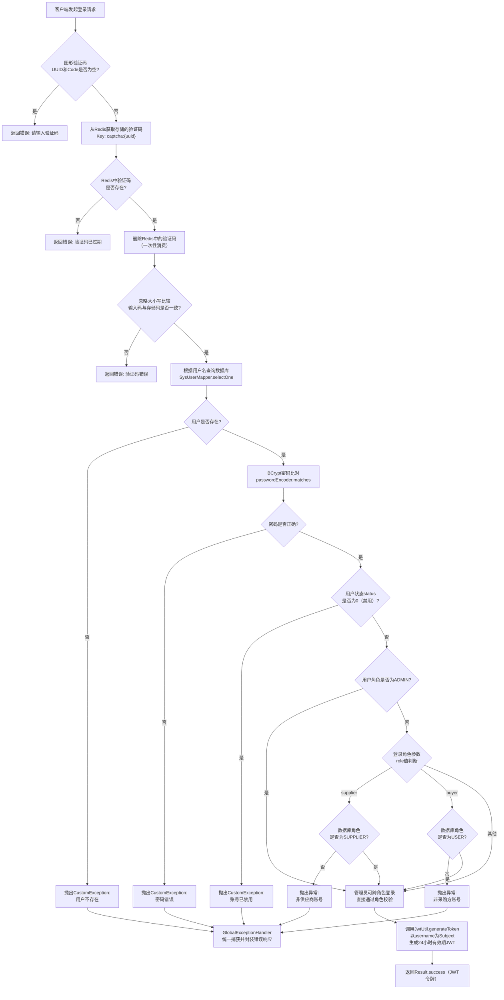

**图4-1 用户登录认证流程图**

如图4-1所示，登录流程首先完成图形验证码的校验（Redis一次性消费机制），然后依次进行用户存在性检查、BCrypt密码比对、账号状态校验和角色匹配。管理员角色拥有跨角色登录特权。全部校验通过后，使用HS256算法生成有效期为24小时的JWT令牌。

### 4.2 JWT请求认证过滤流程

每个HTTP请求到达控制器前，都会经过`JwtAuthenticationTokenFilter`进行令牌解析与用户身份加载。

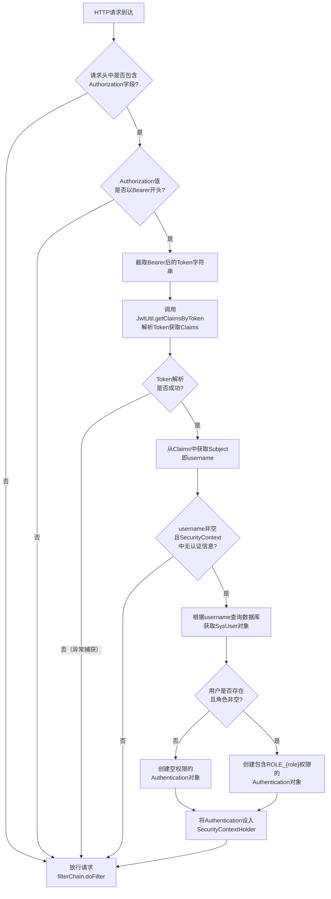

**图4-2 JWT请求认证过滤流程图**

如图4-2所示，JWT过滤器采用非阻断式设计，令牌缺失或解析失败时不拦截请求而是直接放行，由后续的Spring Security权限控制决定是否允许访问。当令牌有效时，过滤器从数据库加载用户角色信息并注入Spring Security上下文，为后续的`@PreAuthorize`注解鉴权提供依据。

### 4.3 用户注册流程

用户注册涉及图形验证码、邮箱验证码双重验证以及密码加密等关键步骤。

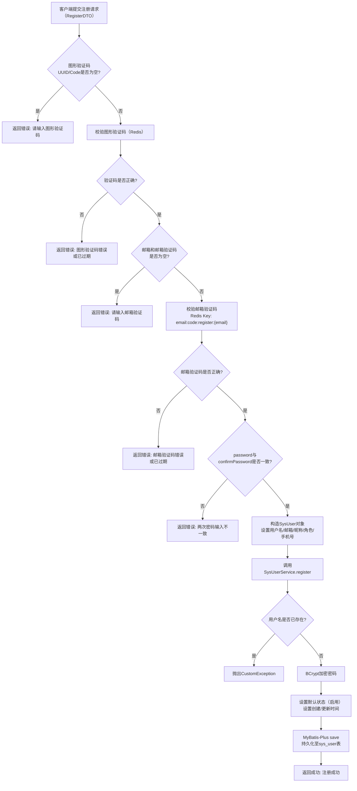

**图4-3 用户注册流程图**

### 4.4 购物车与订单创建流程

订单创建流程从购物车选品到订单生成，涉及Redis数据读取、金额计算、Snowflake订单号生成和事务性数据库写入等核心处理逻辑。

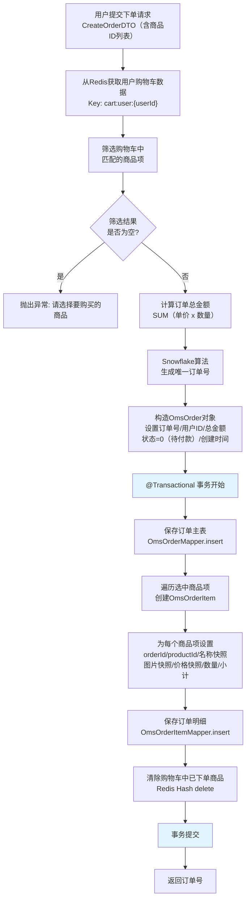

**图4-4 购物车下单流程图**

如图4-4所示，订单创建流程在Spring事务管理下执行，确保订单主表和明细表的写入操作具有原子性。订单号采用Snowflake算法生成，保证分布式环境下的全局唯一性。订单明细中保存商品名称、图片、价格等快照信息，避免商品信息变更对历史订单的影响。

### 4.5 订单状态流转

订单在其生命周期内经历多个状态节点，状态流转由用户操作和管理员操作共同驱动。

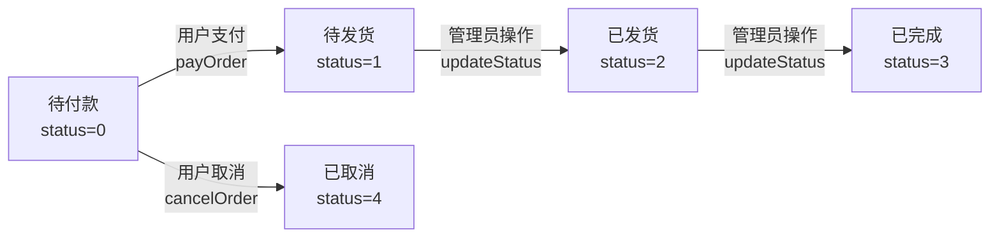

**图4-5 订单状态流转图**

如图4-5所示，订单从创建时的"待付款"状态开始，用户可执行模拟支付（payOrder）将其推进至"待发货"状态，或取消订单转为"已取消"。已付款订单由管理员通过状态更新接口依次推进至"已发货"和"已完成"。仅"待付款"状态的订单允许取消，且支付操作会记录支付时间。

### 4.6 供应商审核流程

供应商审核是管理后台的核心业务流程，审核通过时会联动更新关联用户的角色权限。

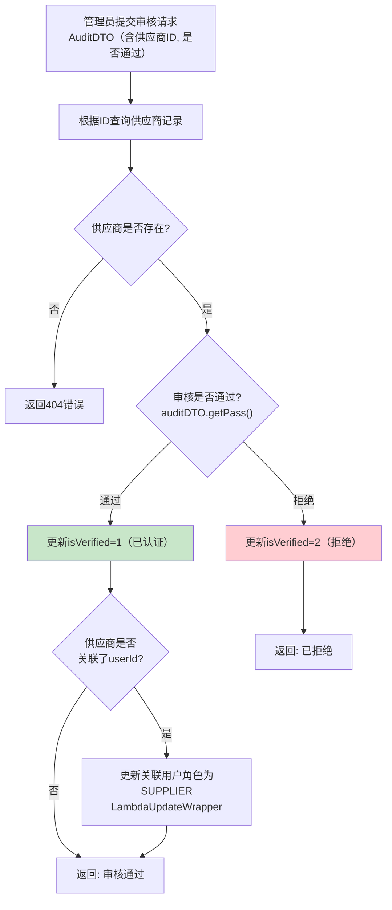

**图4-6 供应商审核流程图**

---

## 5. 数据结构设计

### 5.1 核心数据模型

本节展示系统主要数据实体的结构与关系。系统共包含12张核心数据表，涵盖用户、供应商、商品、分类、订单、租赁、内容及用户交互等领域。

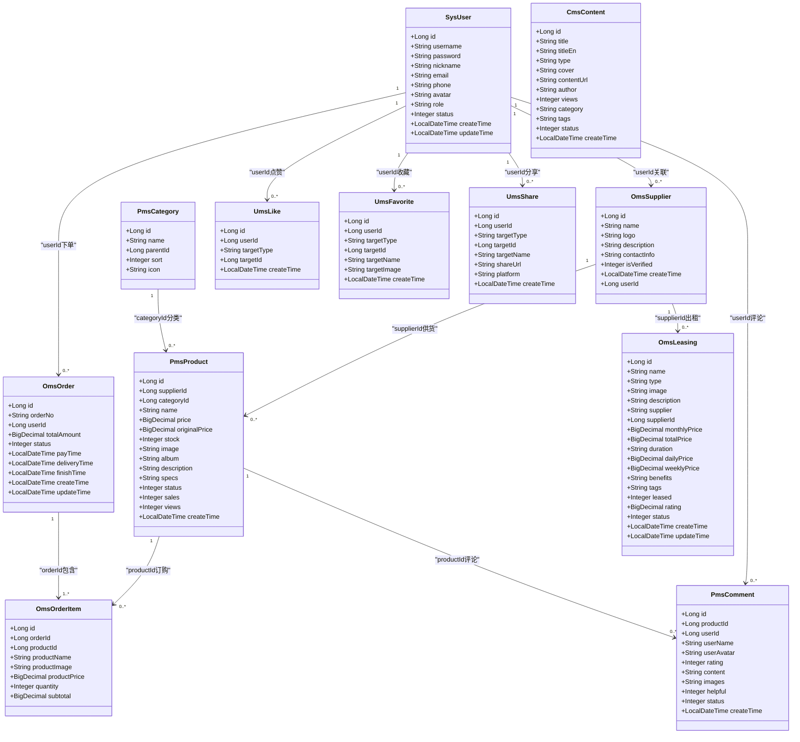

**图5-1 核心数据模型类图**

如图5-1所示，系统数据模型以`SysUser`为核心用户实体，通过外键关联辐射至供应商、订单、评论、点赞、收藏和分享等业务实体。`OmsSupplier`与`PmsProduct`和`OmsLeasing`形成供应关系。`PmsCategory`通过`parentId`支持层级分类结构（0表示顶级分类）。`OmsOrder`与`OmsOrderItem`构成一对多的订单-明细关系，明细中以快照方式保存商品信息。

### 5.2 主要数据表说明

| 表名 | 实体类 | 说明 | 主要约束 |
|------|--------|------|----------|
| sys_user | SysUser | 系统用户表 | username唯一索引 |
| oms_supplier | OmsSupplier | 供应商表 | userId关联sys_user |
| pms_category | PmsCategory | 商品分类表 | parentId支持树形结构 |
| pms_product | PmsProduct | 商品表 | supplier_id外键、category_id外键 |
| oms_order | OmsOrder | 订单表 | order_no唯一索引 |
| oms_order_item | OmsOrderItem | 订单明细表 | order_id索引 |
| oms_leasing | OmsLeasing | 租赁设备表 | supplier_id关联供应商 |
| cms_content | CmsContent | 内容发现表 | 无外键约束 |
| pms_comment | PmsComment | 商品评论表 | product_id索引、user_id索引 |
| ums_like | UmsLike | 用户点赞表 | user_id+target_type+target_id唯一索引 |
| ums_favorite | UmsFavorite | 用户收藏表 | user_id+target_type+target_id唯一索引 |
| ums_share | UmsShare | 分享记录表 | target_type+target_id索引 |

### 5.3 缓存数据结构

系统使用Redis存储以下临时数据：

| 缓存Key格式 | 数据类型 | 有效期 | 用途 |
|-------------|---------|--------|------|
| captcha:{uuid} | String | 5分钟 | 图形验证码文本 |
| email:code:{type}:{email} | String | 5分钟 | 邮箱验证码 |
| cart:user:{userId} | Hash | 30天 | 购物车数据，Field为商品ID，Value为CartItemDTO对象 |

### 5.4 购物车数据传输对象

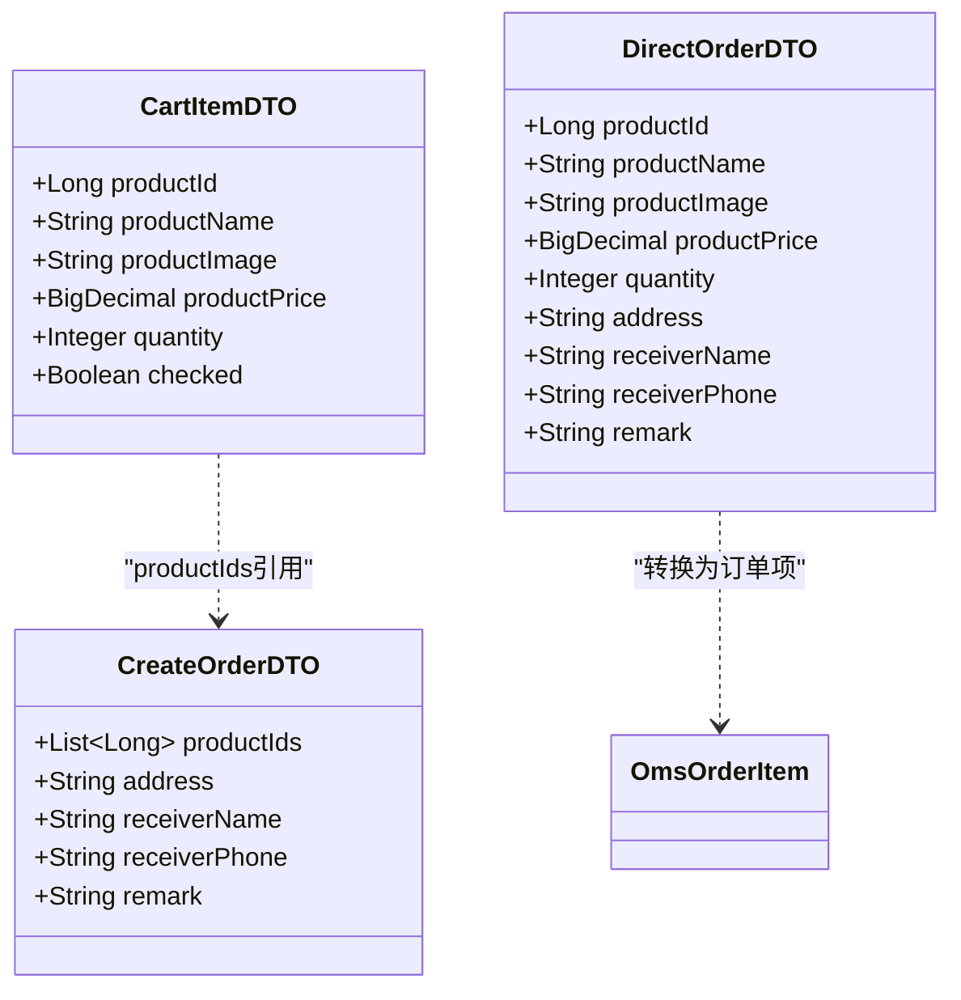

**图5-2 订单相关DTO类图**

---

## 6. 接口设计

### 6.1 接口总体说明

本系统所有API接口遵循RESTful设计规范，采用JSON作为请求与响应的数据格式。所有接口响应均通过统一的`Result<T>`包装类返回，结构如下：

| 字段 | 类型 | 说明 |
|------|------|------|
| code | Integer | 状态码，200表示成功，400表示参数错误，401表示未认证，403表示无权限，404表示资源不存在，500表示服务器内部错误 |
| message | String | 响应消息，成功时为"success"，失败时为具体错误描述 |
| data | T | 响应数据，类型根据接口不同而变化 |

认证方式：需认证的接口在请求头中携带`Authorization: Bearer {JWT令牌}`。

### 6.2 接口模块划分

以下图表展示了本系统的API接口模块划分与主要端点关系：

```mermaid
graph TD
    API["API接口总览"]

    API --> G1["用户端接口"]
    API --> G2["管理端接口"]

    G1 --> E_AUTH["/api/v1/user<br/>登录/注册/重置密码/用户信息"]
    G1 --> E_CAPTCHA["/api/v1/captcha<br/>获取图形验证码"]
    G1 --> E_EMAIL["/api/v1/email<br/>发送邮箱验证码"]
    G1 --> E_PROD["/api/product<br/>商品列表/详情/分类"]
    G1 --> E_CAT["/api/v1/category<br/>分类CRUD"]
    G1 --> E_SUP["/api/v1/supplier<br/>供应商列表/详情/CRUD"]
    G1 --> E_LEASE["/api/leasing<br/>租赁设备列表/详情"]
    G1 --> E_CONT["/api/v1/content<br/>内容列表/详情/CRUD"]
    G1 --> E_CART["/api/v1/cart<br/>购物车增删改查/清空"]
    G1 --> E_ORD["/api/v1/order<br/>创建订单/列表/详情/支付/取消"]

    G2 --> A_AUTH["/api/admin<br/>管理员登录/信息获取"]
    G2 --> A_DASH["/api/admin/dashboard<br/>统计数据/最新用户/最新商品"]
    G2 --> A_USER["/api/admin/user<br/>用户CRUD/封禁/重置密码/批量操作"]
    G2 --> A_PROD["/api/admin/product<br/>商品CRUD/上下架/批量操作"]
    G2 --> A_SUP["/api/admin/supplier<br/>供应商CRUD/审核/认证状态"]
    G2 --> A_ORD["/api/admin/order<br/>订单查询/状态更新/删除/统计"]
    G2 --> A_LEASE["/api/admin/leasing<br/>租赁设备CRUD/上下架"]
    G2 --> A_INTER["/api/admin/interaction<br/>评论/点赞/收藏/分享管理"]
```

**图6-1 API接口模块结构图**

### 6.3 核心接口说明

#### 6.3.1 系统认证接口

| 端点 | 方法 | 说明 | 主要参数 | 返回值 |
|------|------|------|----------|--------|
| /api/v1/user/login | POST | 用户登录 | LoginDTO（username, password, captchaUuid, captchaCode, role） | Result\<String\>（JWT令牌） |
| /api/v1/user/register | POST | 用户注册 | RegisterDTO（username, password, confirmPassword, email, nickname, role, captchaUuid, captchaCode, emailCode, phone） | Result\<String\> |
| /api/v1/user/reset-password | POST | 密码重置 | ResetPasswordDTO（username, email, emailCode, newPassword, confirmPassword, captchaUuid, captchaCode） | Result\<String\> |
| /api/v1/user/info | GET | 获取用户信息 | Principal（从JWT解析） | Result\<SysUser\> |
| /api/v1/captcha/image | GET | 获取图形验证码 | 无 | Result\<Map\>（uuid, imageBase64） |
| /api/v1/email/send | POST | 发送邮箱验证码 | Map（email, type） | Result\<String\> |

#### 6.3.2 商品与分类接口

| 端点 | 方法 | 说明 | 主要参数 | 返回值 |
|------|------|------|----------|--------|
| /api/product/list | GET | 商品列表 | page, size, name, categoryId, sort, includeOffShelf | Result\<IPage\<PmsProduct\>\> |
| /api/product/{id} | GET | 商品详情 | id（路径参数） | Result\<PmsProduct\> |
| /api/product/categories | GET | 获取分类 | 无 | Result\<List\<PmsCategory\>\> |

#### 6.3.3 购物车与订单接口

| 端点 | 方法 | 说明 | 主要参数 | 返回值 |
|------|------|------|----------|--------|
| /api/v1/cart | GET | 获取购物车 | Principal | Result\<List\<CartItemDTO\>\> |
| /api/v1/cart/add | POST | 添加到购物车 | productId, quantity | Result\<String\> |
| /api/v1/cart/update | PUT | 更新数量 | productId, quantity | Result\<String\> |
| /api/v1/cart/remove/{productId} | DELETE | 移除商品 | productId | Result\<String\> |
| /api/v1/cart/clear | DELETE | 清空购物车 | Principal | Result\<String\> |
| /api/v1/order/create | POST | 购物车下单 | CreateOrderDTO | Result\<String\>（订单号） |
| /api/v1/order/direct | POST | 直接下单 | DirectOrderDTO | Result\<String\>（订单号） |
| /api/v1/order/list | GET | 用户订单列表 | page, size, status | Result\<Page\<OmsOrder\>\> |
| /api/v1/order/{orderId} | GET | 订单详情 | orderId | Result\<Map\>（order, items） |
| /api/v1/order/pay/{orderId} | POST | 模拟支付 | orderId | Result\<String\> |
| /api/v1/order/cancel/{orderId} | POST | 取消订单 | orderId | Result\<String\> |

#### 6.3.4 管理后台核心接口

| 端点 | 方法 | 说明 | 主要参数 | 返回值 |
|------|------|------|----------|--------|
| /api/admin/login | POST | 管理员登录 | AdminLoginDTO | Result\<String\>（JWT令牌） |
| /api/admin/dashboard/stats | GET | 仪表盘统计 | 无 | Result\<Map\>（各项计数） |
| /api/admin/supplier/audit | POST | 供应商审核 | AuditDTO（id, pass） | Result\<String\> |
| /api/admin/order/{id}/status | PUT | 更新订单状态 | id, status | Result\<String\> |
| /api/admin/product/off-shelf | POST | 强制下架 | Map（id） | Result\<String\> |
| /api/admin/user/{userId}/status | PUT | 封禁/解封用户 | userId, status | Result\<String\> |

### 6.4 接口调用时序示例

以下展示用户从登录到下单的典型接口调用时序：

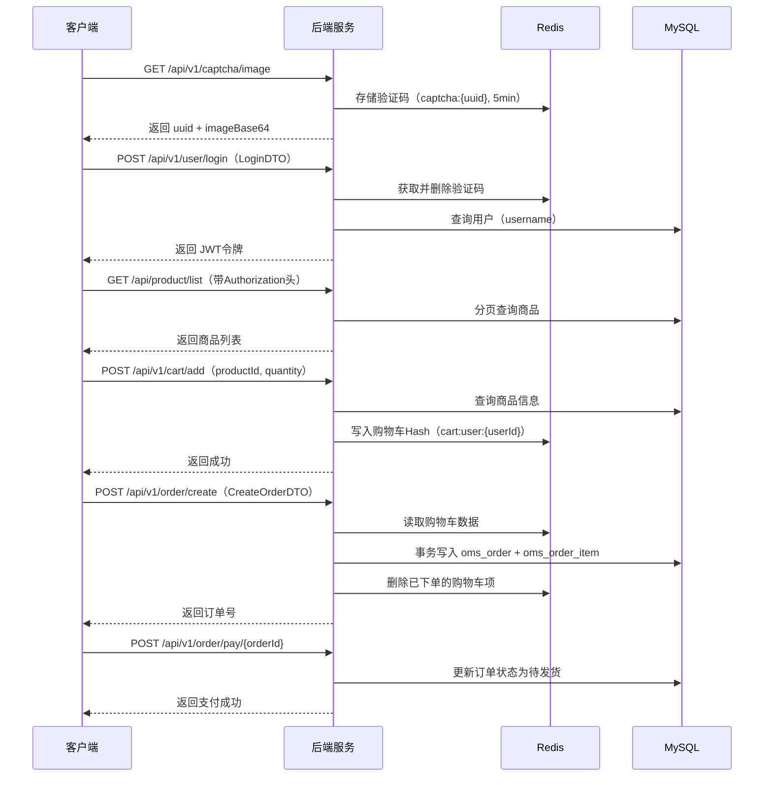

**图6-2 用户下单典型时序图**

---

## 7. 异常处理设计

### 7.1 全局异常处理机制

本系统通过`GlobalExceptionHandler`类（标注`@RestControllerAdvice`）实现全局异常的统一捕获与响应封装。异常处理分为两个层级：

1. **业务异常（CustomException）**：由业务逻辑中主动抛出，携带自定义错误码（code）和错误消息（message）。例如"用户不存在"（code=500）、"密码错误"（code=500）、"验证码错误"（code=400）等。
2. **系统异常（Exception）**：捕获所有未被业务异常处理器拦截的运行时异常和受检异常，统一返回500错误码，并附带异常信息以便排查。

两类异常均通过`Result.error(code, message)`封装为标准的JSON响应返回给客户端。

### 7.2 异常处理流程

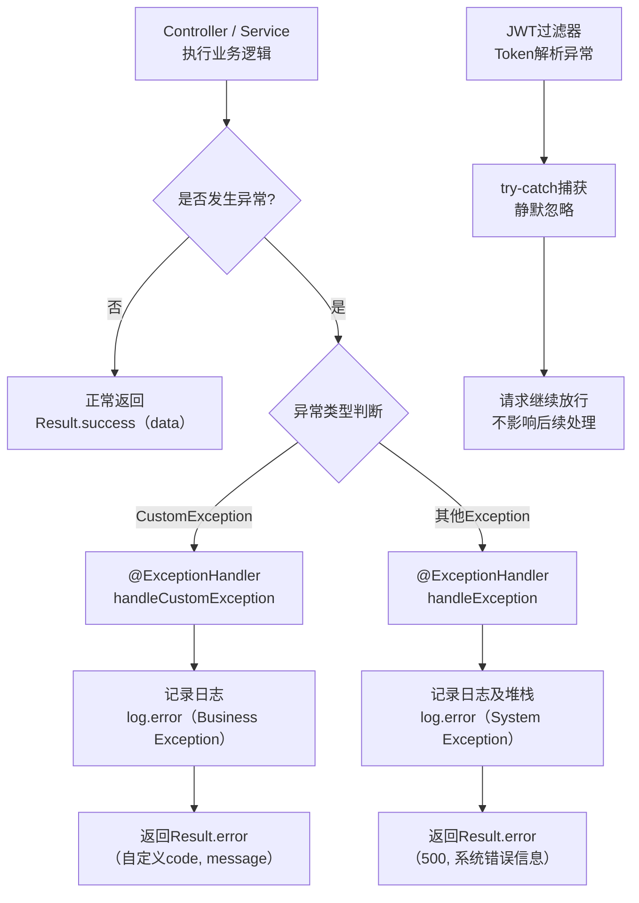

**图7-1 全局异常处理流程图**

如图7-1所示，所有控制器和服务层抛出的异常均由全局异常处理器统一拦截。`CustomException`用于可预见的业务校验失败场景，保留业务层定义的错误码和消息；未预见的系统异常则统一返回500状态码。JWT过滤器中的令牌解析异常采用静默捕获策略，确保不因令牌问题导致请求中断。

### 7.3 主要异常场景

系统代码中已显式处理的主要异常场景如下表所示：

| 异常场景 | 处理位置 | 错误码 | 错误消息 |
|---------|---------|--------|---------|
| 图形验证码为空 | SysUserController | 400 | 请输入验证码 |
| 图形验证码错误或过期 | SysUserController | 400 | 验证码错误或已过期 |
| 邮箱验证码为空 | SysUserController | 400 | 请输入邮箱验证码 |
| 邮箱验证码错误或过期 | SysUserController | 400 | 邮箱验证码错误或已过期 |
| 密码确认不一致 | SysUserController | 400 | 两次密码输入不一致 |
| 用户不存在 | SysUserService | 500 | 用户不存在 |
| 密码错误 | SysUserService | 500 | 密码错误 |
| 账号已禁用 | SysUserService | 500 | 账号已禁用 |
| 角色不匹配 | SysUserService | 500 | 该账号不是供应商/采购方账号 |
| 用户名已存在 | SysUserService | 500 | Username already exists |
| 用户名或邮箱不匹配 | SysUserService | 500 | 用户名或邮箱错误 |
| 非管理员登录后台 | AdminAuthController | 500 | 无权访问管理后台 |
| 商品不存在 | PmsProductController | 404 | 商品不存在 |
| 供应商不存在 | AdminSupplierController | 404 | 供应商不存在 |
| 设备不存在 | OmsLeasingController | 404 | 设备不存在 |
| 订单不存在 | OmsOrderService | 500 | 订单不存在 |
| 订单状态异常 | OmsOrderService | 500 | 订单状态异常 |
| 仅待付款可取消 | OmsOrderService | 500 | 只有待付款订单可以取消 |
| 购物车无选中商品 | OmsOrderService | 500 | 请选择要购买的商品 |
| 删除管理员禁止 | AdminUserController | 403 | 不能删除管理员账号 |
| 修改管理员角色禁止 | AdminUserController | 403 | 不能修改管理员角色 |
| 封禁管理员禁止 | AdminUserController | 403 | 无法更改管理员状态 |
| 邮箱格式校验失败 | EmailController | 400 | 邮箱格式不正确 |
| 邮件发送失败 | EmailService | 500 | 验证码发送失败 |
| JWT令牌无效或过期 | JwtAuthenticationTokenFilter | — | 静默忽略，请求放行 |
| 未登录访问受保护接口 | SysUserController | 401 | 未登录 |

### 7.4 事务回滚策略

系统在以下关键操作中启用了Spring声明式事务管理，确保数据一致性：

1. **订单创建**（OmsOrderService.createOrder / createDirectOrder）：通过`@Transactional(rollbackFor = Exception.class)`注解，确保订单主表写入、订单明细写入和购物车清理操作的原子性。任何步骤发生异常时，所有数据库操作全部回滚。

2. **订单状态变更**（OmsOrderService.payOrder / cancelOrder）：在事务保护下更新订单状态和时间戳，避免并发场景下的状态不一致。

3. **供应商审核**（AdminSupplierController.audit）：通过`@Transactional(rollbackFor = Exception.class)`注解，确保供应商认证状态更新和关联用户角色升级两个操作的原子性，避免出现供应商已认证但用户角色未更新的不一致状态。
