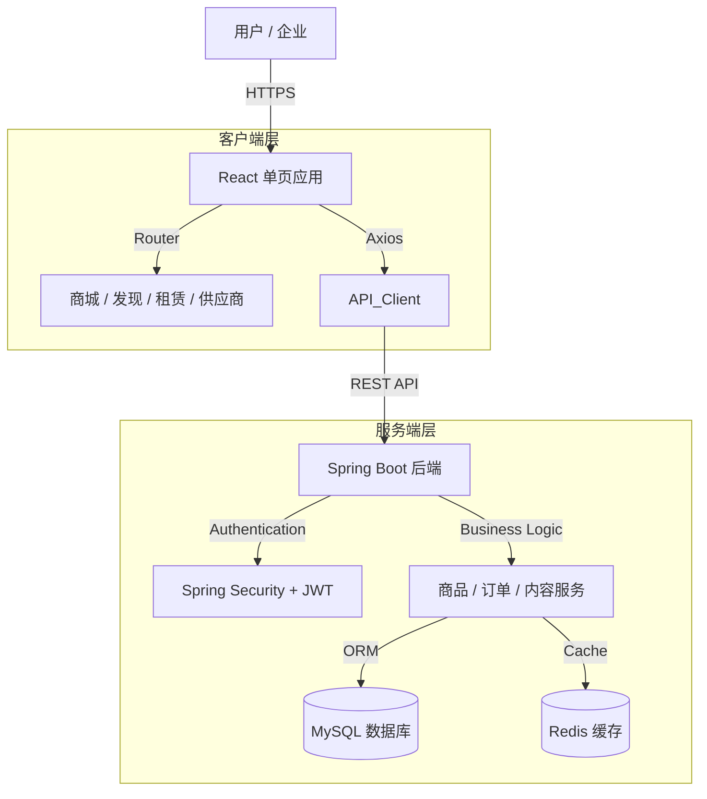

<div align="center">

# MinJue (懂视帝)

### B2B工业设备宣传与电商平台

**[ B2B电商 | 视频内容 | 设备租赁 | 企业服务 ]**

<p>
  
  
  
  
  
</p>

**"[ v1.0 基础服务 ] - [ v2.0 电商交易 ] - [ v3.0 智能服务 ]" 全周期闭环**

[ 商城 ] · [ 发现 ] · [ 租赁 ] · [ 供应商 ]

---
</div>

## 📖 项目介绍

**MinJue (懂视帝)** 致力于打造工业设备领域的综合性B2B平台。通过融合电商交易与视频内容发现（类Bilibili模式），解决工业采购中的信息透明度问题。平台支持多种租赁模式（融资租赁/经营租赁），并提供详尽的供应商资质展示，建立商业互信。

## ✨ 核心功能

| 模块 | 功能 | 说明 |
|------|------|------|
| **商城** | **产品矩阵** | 覆盖12大类工业设备，包括AI视觉检测、工业相机、镜头光源、机器人等。 |
| **商城** | **智能筛选** | 支持多维度筛选、排序及网格/列表视图切换，提升设备查找效率。 |
| **发现** | **视频内容** | 类Bilibili的视频社区，包含设备测评、操作教程和行业洞察。 |
| **租赁** | **双模租赁** | 灵活支持融资租赁（Financial Leasing）和经营租赁（Operating Leasing）。 |
| **供应商** | **企业档案** | 全方位展示企业资质（ISO认证等）、经营数据及完整产品线。 |
| **交互** | **在线咨询** | 支持与供应商进行实时在线沟通。 |
| **管理后台** | **供应商审核** | 管理员审核供应商资质，通过/拒绝申请。 |
| **管理后台** | **用户管理** | 用户列表、封禁/解封、角色管理。 |
| **管理后台** | **商品监管** | 商品列表、强制下架、违规处理。 |
| **管理后台** | **数据统计** | 仪表盘统计用户、供应商、商品、订单数据。 |

---

## 🏗️ 技术栈

### 🌐 前端 (Frontend)
- **框架**: React 19.2.0
- **构建工具**: Vite 7.2.4
- **样式**: Tailwind CSS 4.1.17
- **路由**: React Router DOM 7.9.6
- **图标**: Lucide React 0.554.0

### 🔧 后端 (Backend)
- **核心框架**: Spring Boot 3.2.2
- **数据库**: MySQL 8.0+
- **ORM框架**: MyBatis Plus 3.5.5
- **缓存**: Redis
- **安全认证**: Spring Security + JWT 0.11.5
- **工具库**: Hutool 5.8.25, Knife4j 4.5.0 (接口文档)

---

## 🧭 系统架构



---

## 📁 目录结构

```
MinJue/
├── backend/                        # Spring Boot 后端工程
│   ├── src/main/java/com/minjue/modules/
│   │   ├── system/                 # 系统模块 (用户, 角色, 权限, 认证)
│   │   ├── product/                # 商品模块 (SPU, SKU, 分类)
│   │   ├── order/                  # 订单模块 (购物车, 订单流转)
│   │   ├── content/                # 内容模块 (视频, 文章)
│   │   ├── supplier/               # 供应商模块 (企业信息, 资质)
│   │   └── admin/                  # 管理后台模块 (NEW)
│   ├── src/main/resources/
│   │   ├── mapper/                 # MyBatis XML 映射文件
│   │   ├── application.yml         # 核心配置文件
│   │   ├── init.sql                # 数据库初始化脚本
│   │   └── update_admin_password.sql # 管理员密码更新脚本
│   └── pom.xml                     # Maven 依赖配置
├── frontend/                       # React 前端工程
│   ├── public/                     # 静态资源入口
│   ├── src/
│   │   ├── assets/                 # 静态图片/媒体资源
│   │   ├── components/             # 通用 UI 组件 (Layout, Navbar, Footer...)
│   │   ├── pages/                  # 路由页面
│   │   │   ├── auth/               # 认证页 (登录, 注册)
│   │   │   ├── mall/               # 商城页
│   │   │   ├── product/            # 商品详情页
│   │   │   ├── supplier/           # 供应商详情页
│   │   │   └── ...                 # 其他页面
│   │   ├── routes/                 # 路由配置
│   │   ├── store/                  # 状态管理 (Zustand/Context)
│   │   └── utils/                  # 工具函数 (Axios封装, 格式化)
│   ├── package.json                # 项目依赖配置
│   ├── tailwind.config.js          # Tailwind CSS 配置
│   └── vite.config.js              # Vite 构建配置
├── ADMIN_DEVELOPMENT_GUIDE.md      # 管理后台开发指南
└── README.md                       # 项目主文档
```

---

## 🚀 快速开始

### 1️⃣ 环境准备 (Prerequisites)
- **JDK**: 17+
- **Node.js**: 18+
- **MySQL**: 8.0+
- **Redis**: 6.0+
- **构建工具**: Maven 3.8+, npm/yarn

### 2️⃣ 数据库初始化
1. 创建数据库 `minjue_db`.
2. 运行后端 `src/main/resources/sql` 目录下的 SQL 脚本完成表结构和数据初始化.

### 3️⃣ 本地开发运行 (Local Development)

#### 后端启动
```bash
cd backend
# 确保 application.yml 配置了正确的 MySQL 和 Redis连接信息
mvn clean install
java -jar target/minjue-backend-0.0.1-SNAPSHOT.jar
# 服务启动于端口: 8080
```

#### 前端启动
```bash
cd frontend
npm install
npm run dev
# 访问地址: http://localhost:5173
```

### 4️⃣ Docker 容器化部署 (Docker Deployment)

如果你希望使用 Docker 快速部署，请参考以下配置。

#### a. 创建 Dockerfile

**后端 (backend/Dockerfile)**:
```dockerfile
FROM openjdk:17-jdk-slim
WORKDIR /app
COPY target/minjue-backend-0.0.1-SNAPSHOT.jar app.jar
EXPOSE 8080
ENTRYPOINT ["java", "-jar", "app.jar"]
```

**前端 (frontend/Dockerfile)**:
```dockerfile
# Build Stage
FROM node:18 AS build
WORKDIR /app
COPY package*.json ./
RUN npm install
COPY . .
RUN npm run build

# Production Stage
FROM nginx:alpine
COPY --from=build /app/dist /usr/share/nginx/html
EXPOSE 80
CMD ["nginx", "-g", "daemon off;"]
```

#### b. 使用 Docker Compose 一键启动

在项目根目录创建 `docker-compose.yml`:

```yaml
version: '3.8'
services:
  mysql:
    image: mysql:8.0
    environment:
      MYSQL_ROOT_PASSWORD: root
      MYSQL_DATABASE: minjue_db
    ports:
      - "3306:3306"
    volumes:
      - mysql_data:/var/lib/mysql

  redis:
    image: redis:6.2
    ports:
      - "6379:6379"

  backend:
    build: ./backend
    ports:
      - "8080:8080"
    environment:
      SPRING_DATASOURCE_URL: jdbc:mysql://mysql:3306/minjue_db?useUnicode=true&characterEncoding=utf-8&useSSL=false
      SPRING_DATA_REDIS_HOST: redis
    depends_on:
      - mysql
      - redis

  frontend:
    build: ./frontend
    ports:
      - "80:80"
    depends_on:
      - backend

volumes:
  mysql_data:
```

#### c. 启动服务
```bash
# 1. 确保已在 backend 目录下运行 mvn clean package 生成 jar 包
# 2. 启动集群
docker-compose up -d --build
```

---

## 📅 开发路线

- [x] **v1.0 基础服务 (2024-01-15)**: 完成产品分类、视频发现、租赁模式及响应式布局。
- [x] **v2.0 电商交易 (2024-01-20)**: 上线完整商城功能、商品详情、供应商主页、购物车及筛选功能。
- [x] **v2.1 管理后台 (2025-01-29)**: 完成管理员认证、供应商审核、用户管理、商品监管等功能。
- [ ] **v3.0 智能服务**: 规划AI智能推荐、智能客服及移动端App适配。

---

## 🔐 管理后台 API

### 认证接口
- `POST /api/admin/login` - 管理员登录
- `GET /api/admin/info` - 获取管理员信息
- `GET /api/admin/dashboard/stats` - 仪表盘统计数据

### 供应商审核
- `GET /api/admin/supplier/audit/list` - 待审核供应商列表
- `GET /api/admin/supplier/list` - 所有供应商列表
- `GET /api/admin/supplier/{id}` - 供应商详情
- `POST /api/admin/supplier/audit` - 审核供应商

### 用户管理
- `GET /api/admin/user/list` - 用户列表
- `GET /api/admin/user/{id}` - 用户详情
- `PUT /api/admin/user/{userId}/status` - 封禁/解封用户

### 商品监管
- `GET /api/admin/product/list` - 商品列表
- `GET /api/admin/product/{id}` - 商品详情
- `PUT /api/admin/product/{productId}/off-shelf` - 强制下架
- `PUT /api/admin/product/{productId}/on-shelf` - 上架商品

**测试账号**: `admin` / `123456`

---

## 📝 许可证
MIT License

<div align="center">
<p style="margin: 10px 0 0;">
    Development Team:<br>
    主开发: <a href="https://github.com/IceYuanyyy" target="_blank" style="color: #666; text-decoration: underline;">IceYuanyyy</a> &nbsp;|&nbsp;
    副开发: <a href="https://github.com/varedias" target="_blank" style="color: #666; text-decoration: underline;">varedias</a>
</p>
</div>
