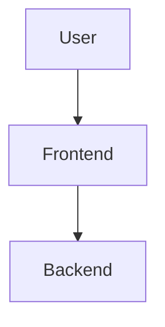

<div align="center">

# [Project Name]

### [Detailed Description/Subtitle]
**[ Tech 1 | Tech 2 | Tech 3 | Tech 4 ]**

<p>
  
  
</p>

**"[Phase 1] - [Phase 2] - [Phase 3]" Full Cycle Loop**

[ Module 1 ] · [ Module 2 ] · [ Module 3 ]

---
</div>

## 📖 (Project Overview)

[Description of the project goals, core philosophy, and main pain points it solves.]

## ✨ (Core Features)

| Module | Feature | Description |
|--------|---------|-------------|
| **Category 1** | **Feature Name** | Description of the feature. |
| **Category 2** | **Feature Name** | Description of the feature. |

---

## 🏗️ (Tech Stack)

### 🌐 Frontend
- **Framework**: Description.
- **Library**: Description.

### 🔧 Backend
- **Framework**: Description.
- **Library**: Description.

### 🤖 AI & Data
- **Model**: Description.
- **Algorithm**: Description.

---

## 🧭 (Architecture)



---

## 📁 (Directory Structure)

```
project-root/
├── backend/
└── frontend/
└── README.md
```

---

## 🚀 (Quick Start)

### 1️⃣ Prerequisites
- Req 1
- Req 2

### 2️⃣ Database Init
Description...

### 3️⃣ Backend Startup
Description...

### 4️⃣ Frontend Startup
```bash
npm install
npm run dev
```

---

## 📅 (Roadmap)

- [x] **P0 Phase**: Task 1.
- [ ] **P1 Phase**: Task 2.

---

## 📝 License
MIT License

## 👨‍💻 Author
- **Name**: [Your Name]
- **Email**: [Your Email]
- **GitHub**: [Link]

<div align="center">
Made with ❤️ by [Your Name]
</div>
